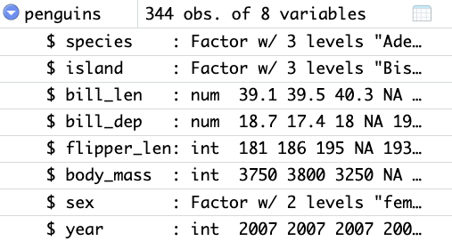

---
output:
  pdf_document: default
  html_document: default
---
## L1.8 In-class Assignment -- Lists and Data Frames
### CPSC 292 -- 9/11/2026

__Name:__ \underline{\hspace{4in}} __Section:__ \underline{\hspace{1in}}

\vspace{0.5cm}

__Collaboration team:__ \underline{\hspace{5in}}

## Question 1

Describe in which ways accessing items in lists and data frames are different and in which ways they are similar. 

\vspace{4cm}

## Question 2

Describe the ways in which data frames are similar to matrices and in which ways they are different.

\vspace{4cm}

## Question 3

Construct a list that has five members, each member is a vector of length 10 of a different atomic data type in R. 

\vspace{3cm}

## Question 4

Replace at least one word in the character data type of your list in Question 3 with the word "dingbat" using `sub`. 

\newpage

## Question 5

{width=50%}

 a. For the `penguins` data set in Fig. 1, describe the data in each column and list the class. 

\vspace{5cm}

 b. You would like to add a column of data to the `penguins` data set (Fig. 1) describing how tall the penguins are. Write a line of code that adds the column assuming the height of each penguin in the data set is stored in a vector named `height`.
 
\vspace{5cm}
 
 c. You need to calculate the mean body mass of female penguins in this data set. Write a line of code that does this. (Assume that female penguins are coded as `female`.)

